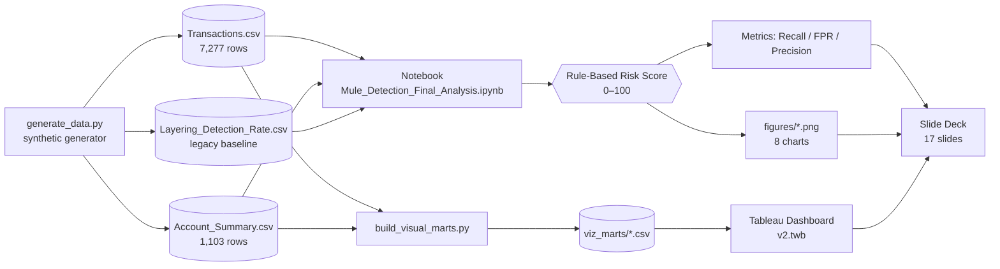
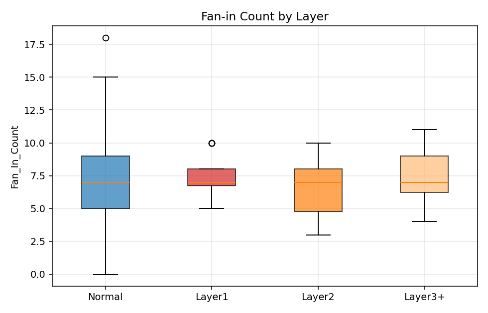
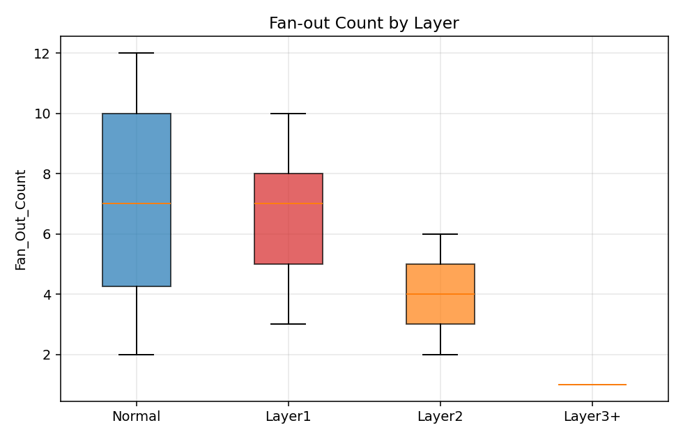
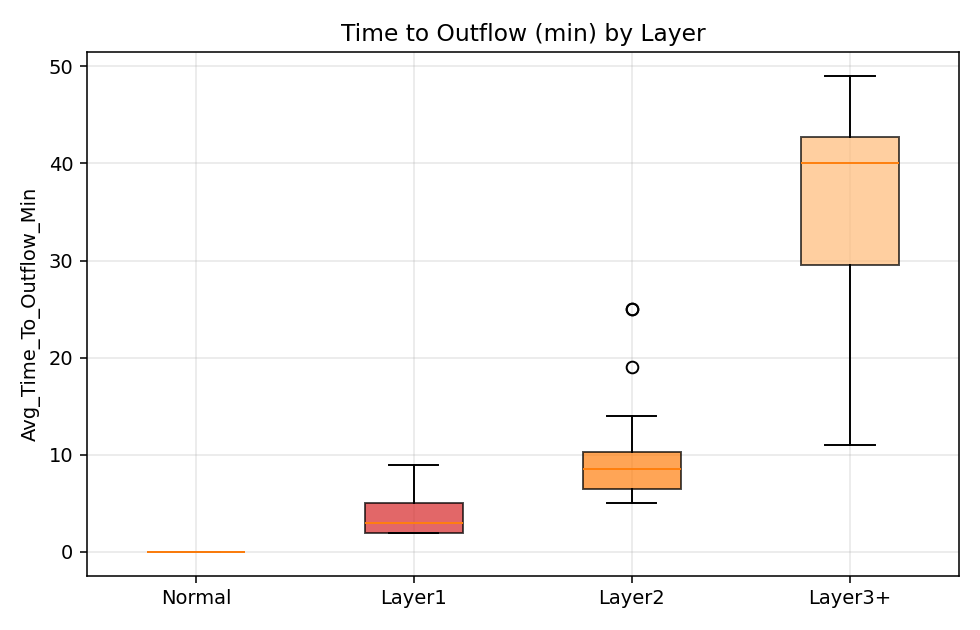
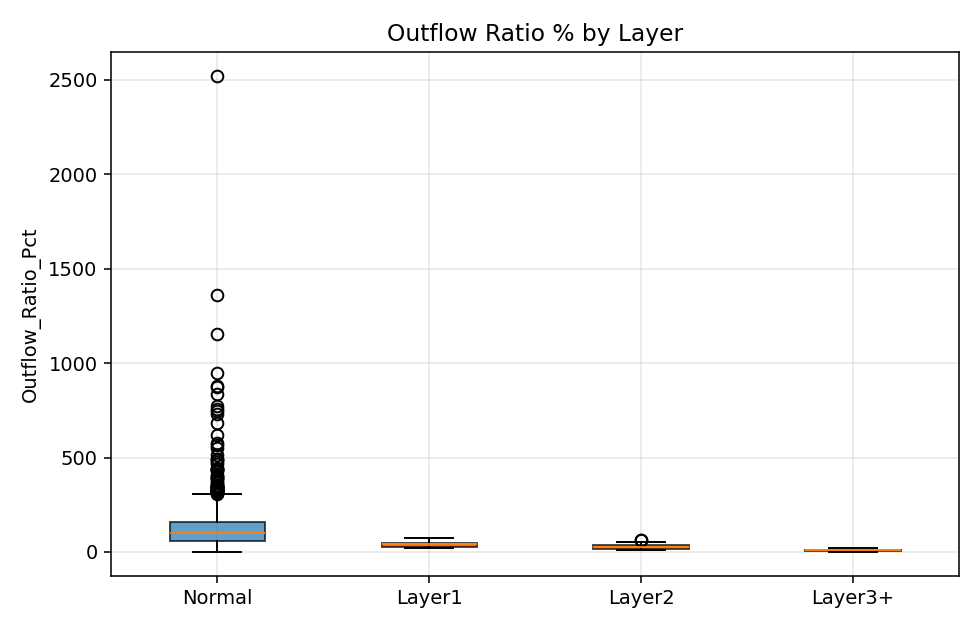
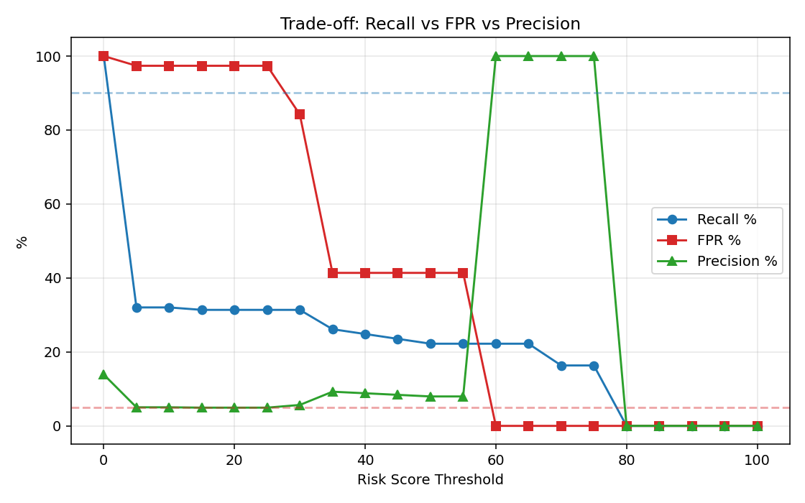
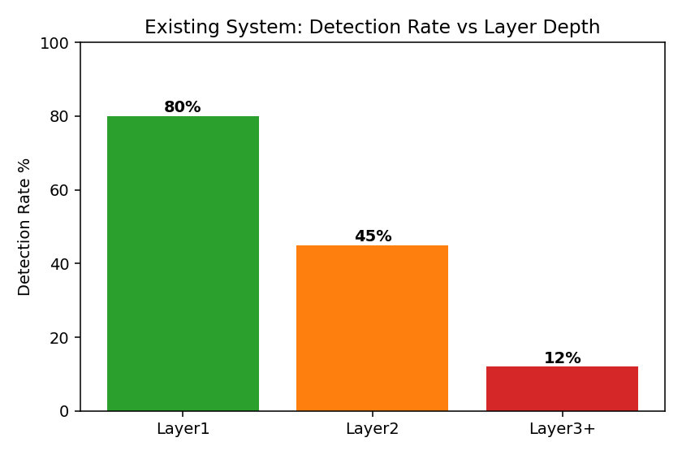
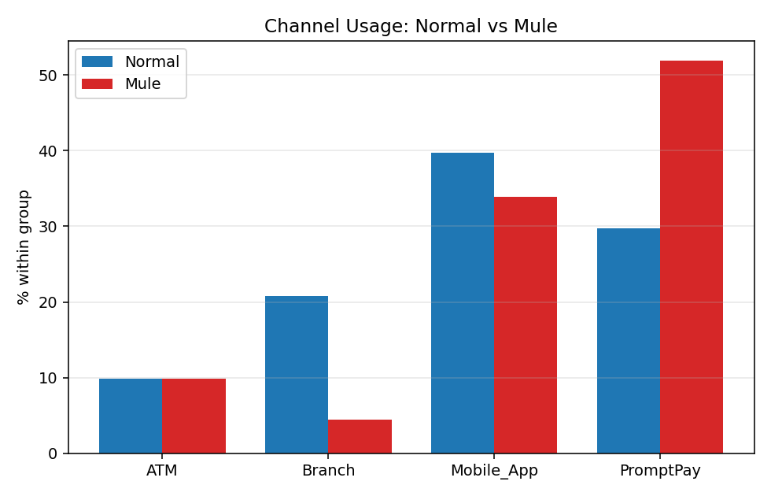
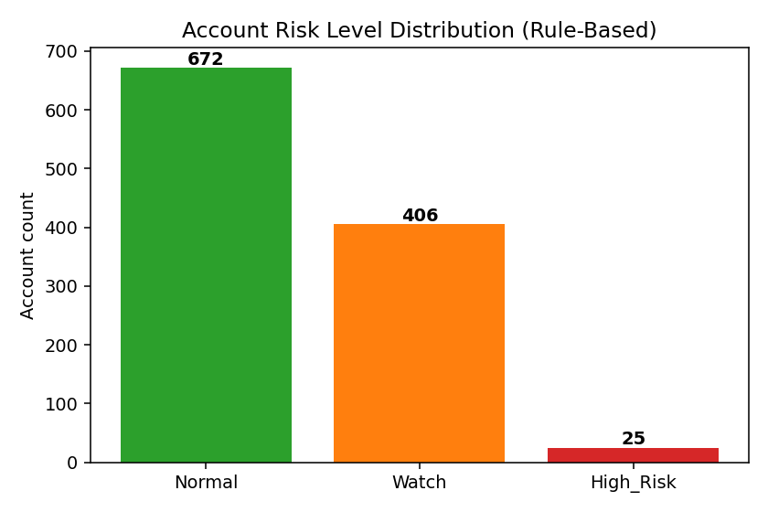

<div align="center">

# 🕵️ DE471 Final Project — Mule Account Detection

**การตรวจจับบัญชีม้า (Money Mule) ผ่าน Fan-in/Fan-out + Layering Depth**


[](https://colab.research.google.com/github/Lizosy/De471-mule-detection/blob/main/02_Notebooks/Mule_Detection_Final_Analysis.ipynb)

</div>

---

## 🎯 TL;DR

> Rule-based Risk Score (Fan-in / Hit & Run / Outflow / New-account) ตรวจ Mule ได้ **Precision 100% · FPR 0% · Recall 16.3%** ที่ threshold 70 — ดีพอจะใช้เป็น *trigger ขั้นแรก* แต่ **ยังไม่เข้าเป้า Recall ≥ 90%** จึงต้องเสริม ML stage (LogReg / RF / XGBoost) + Graph DB (Neo4j) ในเฟสถัดไป

| Metric | Legacy | Ours @ T=70 | Target |
|---|---|---|---|
| Layer3+ Detection | 12% | (Rule + Layer-aware) | ≥ 80% |
| FPR | n/a | **0.0%** | ≤ 5% |
| Precision | n/a | **100%** | high |
| Recall (overall) | n/a | 16.3% | ≥ 90% |

## 📚 Table of Contents

1. [Deliverables](#-deliverables)
2. [Repository structure](#-โครงสร้าง)
3. [Reproduce](#-reproduce)
4. [Pipeline diagram](#-pipeline)
5. [Risk Score formula](#-risk-score-formula)
6. [Key results](#-key-results-rule-based-detection)
7. [Visualizations (Notebook)](#-visualizations-notebook)
8. [Tableau Dashboards](#%EF%B8%8F-tableau-dashboards)
9. [Top-10 Risky Accounts](#-top-10-risky-accounts)
10. [Dataset schema](#-dataset-schema)
11. [From the PDF](#-from-the-pdf--background-hypothesis--findings)
12. [Project Canvas](#%EF%B8%8F-project-canvas)
13. [Roadmap](#-roadmap--next-steps)
14. [References](#reference)

## 📦 Deliverables

- 📄 **Slide Deck (PDF)** — โครงสร้าง 17 slides ที่ [`05_final/Slide_FanInOut_Layering_Prompt.txt`](05_final/Slide_FanInOut_Layering_Prompt.txt)
- 🗂️ **Project Canvas (PDF)** — ภาพรวม 1 หน้า: [`PROJECT_CANVAS.md`](PROJECT_CANVAS.md) *(ดูข้างล่าง)*
- 💻 **GitHub Repository** — repo นี้
- 🎤 **Live 7-min Presentation + 3-min Q&A**

## Repository scope

Repo นี้เก็บเฉพาะไฟล์ที่เกี่ยวกับ **Final** เท่านั้น (ไฟล์ midterm / HW เก่าถูก ignore ไว้ใน `.gitignore`)

## 🗂 โครงสร้าง

```
.
├── PROJECT_CANVAS.md                            # 1-page project canvas (deliverable)
├── DE471 Final Project Mule Account Detection.pdf
├── 02_Notebooks/
│   ├── Mule_Detection_Final_Analysis.ipynb      # วิเคราะห์หลัก + Rule-based + Precision/Recall
│   └── figures/                                 # PNG export สำหรับ slide
└── 05_final/
    ├── Slide_FanInOut_Layering_Prompt.txt       # โครง slide deck (17 slides)
    ├── Final Project Instructions and Rubric.txt
    ├── Data_Requirements_Checklist.txt
    ├── generate_data.py                         # script สร้าง synthetic data
    ├── data/
    │   ├── Account_Summary.csv                  (1,103 accounts)
    │   ├── Transactions.csv                     (7,277 transactions)
    │   ├── Layering_Detection_Rate.csv          (legacy baseline)
    │   ├── Mule_Detection_Dashboard*.twb        # Tableau workbooks
    │   └── viz_marts/                           # pre-aggregated CSVs สำหรับ Tableau
    └── 06_visual_pack/
        ├── build_visual_marts.py
        ├── Tableau_Upgrade_Blueprint.md
        ├── Tableau_Calculated_Fields.txt
        └── Slide_Visual_Mapping.csv
```

## ⚙️ Reproduce

```bash
# 1) สร้าง venv + ติดตั้ง package
python -m venv .venv
.venv/Scripts/python -m pip install pandas matplotlib jupyter ipykernel nbconvert

# 2) (ถ้าต้องการ) regenerate data
python 05_final/generate_data.py

# 3) Run notebook (จะ re-export PNG ลง 02_Notebooks/figures/)
.venv/Scripts/python -m jupyter nbconvert --to notebook --execute --inplace \
    02_Notebooks/Mule_Detection_Final_Analysis.ipynb

# 4) (ออปชัน) Rebuild Tableau marts
python 05_final/06_visual_pack/build_visual_marts.py
```

**Open the Tableau dashboard** — เปิด `05_final/data/Mule_Detection_Dashboard_v2.twb` ด้วย Tableau Desktop (Public ก็ได้) แล้วเชื่อมกับ `Account_Summary.csv` + `Transactions.csv` ในโฟลเดอร์เดียวกัน

### ☁️ Run on Google Colab (no install)

[](https://colab.research.google.com/github/Lizosy/De471-mule-detection/blob/main/02_Notebooks/Mule_Detection_Final_Analysis.ipynb)

กด badge → Colab จะเปิด `Mule_Detection_Final_Analysis.ipynb` ให้เลย เซลล์แรกของ notebook (Setup) จะ:

1. ตรวจอัตโนมัติว่ารันบน **Colab** หรือ **local Jupyter**
2. ถ้า Colab → `git clone` repo มา แล้ว `cd` เข้าไป (depth-1, ใช้พื้นที่น้อย)
3. ตั้งค่า `DATA` / `FIG` paths แบบ portable — ไม่ต้องแก้โค้ดเอง

แล้วกด **Runtime → Run all** ก็จะได้ visualization 8 charts (boxplots, trade-off curve, channel, risk level) แสดงในเบราเซอร์เลย ไม่ต้องติดตั้งอะไร

## 🔁 Pipeline



## 🧮 Risk Score formula

Rule-based score (range **0–100**) — apply ต่อบัญชี:

| Rule | Trigger | Points | Captures |
|------|---------|-------:|----------|
| **R1 — Fan-in burst** | `Fan_In_Count > 4` | **+30** | บัญชีรับโอนหลายต้นทาง (collector) |
| **R2 — Hit & Run velocity** | `0 < Avg_Time_To_Outflow_Min ≤ 15` | **+35** | โอนเข้า–ออกในไม่กี่นาที |
| **R3 — Account draining** | `Outflow_Ratio_Pct > 95` | **+25** | เงินไหลออกเกือบ 100% ของยอดเข้า |
| **R4 — New + High Fan-in** | `Account_Age_Days < 60 AND Fan_In_Count > 3` | **+10** | บัญชีอายุน้อยรับโอนผิดปกติ |

```
Risk_Level = Normal   (score 0–39)
           | Watch    (score 40–69)
           | High_Risk(score 70–100)
```

Maximum possible = 100 → threshold ที่ใช้ใน slide = **70 (High_Risk)**

## ✅ Key results (Rule-Based Detection)

| Threshold | Recall | FPR | Precision | TP | FP | TN | FN |
|-----------|-------:|----:|----------:|---:|---:|---:|---:|
| **70 (High_Risk)** | **16.3%** | **0.0%** | **100.0%** | 25 | 0 | 950 | 128 |
| 40 (Watch+) | 24.8% | 41.4% | 8.8% | 38 | 393 | 557 | 115 |

→ ไม่มี threshold ใดเข้าเป้า `Recall ≥ 90% AND FPR ≤ 5%` — ต้องเสริม ML stage

**Confusion matrix @ threshold 70**

```
                Predicted
                Mule    Normal
Actual  Mule    25      128       ← 128 missed (mostly Layer2/3+)
        Normal  0       950       ← 0 false alarms
```

ทำไม Precision 100% แต่ Recall ต่ำ? Rule-based ตั้งเกณฑ์เข้มมาก → จับเฉพาะ Layer1 ที่ "ทำตัวชัด" (Fan-in สูง + Hit & Run + Draining) ส่วน Layer2/3+ ที่ระดับชั้นซ้อนลึก rule ไม่เห็น → ต้องใช้ Graph features + ML

## 📊 Visualizations (Notebook)

Charts ทั้งหมด export จาก `02_Notebooks/Mule_Detection_Final_Analysis.ipynb`
ไปไว้ที่ `02_Notebooks/figures/` เพื่อใช้ใน slide deck

> 💡 อยากเห็นชาร์ตทุกตัวแบบ **interactive** โดยไม่ต้องติดตั้ง? เปิดบน Colab ได้เลย → [](https://colab.research.google.com/github/Lizosy/De471-mule-detection/blob/main/02_Notebooks/Mule_Detection_Final_Analysis.ipynb)

### Behavioral patterns by Layer (Boxplots)

| Fan-in by Layer | Fan-out by Layer |
|---|---|
|  |  |
| ม้า Layer1–2 มี unique senders สูงผิดปกติ | Fan-out ของม้ากระจุกตัว 3–10 บัญชี |

| Time to Outflow | Outflow Ratio |
|---|---|
|  |  |
| Layer1 median = 3 นาที (Hit & Run) | Mule outflow > 95% (Account Draining) |

### Detection performance

| Trade-off curve (threshold sweep) | Legacy detection vs Layer |
|---|---|
|  |  |
| Recall vs FPR vs Precision @ threshold 0–100 | Layer1 80% → Layer2 45% → Layer3+ 12% |

### Channel & Risk distribution

| Channel usage (Normal vs Mule) | Risk Level distribution |
|---|---|
|  |  |
| PromptPay: Mule **52%** vs Normal 30% | High-Risk = 25 accounts (2.3% of 1,103) |

## 🖥️ Tableau Dashboards

Workbook อยู่ที่ `05_final/data/`:

- [`Mule_Detection_Dashboard.twb`](05_final/data/Mule_Detection_Dashboard.twb) — v1
- [`Mule_Detection_Dashboard_v2.twb`](05_final/data/Mule_Detection_Dashboard_v2.twb) — v2 (8 worksheets + main dashboard)

Pre-aggregated marts สำหรับชาร์ตอยู่ที่ `05_final/data/viz_marts/`
และคู่มืออัปเกรด/calculated fields อยู่ใน [`05_final/06_visual_pack/`](05_final/06_visual_pack/)
(`Tableau_Upgrade_Blueprint.md`, `Tableau_Calculated_Fields.txt`, `Slide_Visual_Mapping.csv`)

**Worksheets ที่ตรงกับ Chart ใน slide deck (จาก PDF):**

| # | Tableau Chart | What it shows |
|---|---|---|
| 1 | Fan-in vs Fan-out by Layer | บัญชีม้ามี unique counterparties สูงกว่าบัญชีปกติ |
| 2 | Time to Outflow distribution | Hit & Run: Layer1 ≈ 3 นาที |
| 3 | Outflow Ratio vs Fan-in (Scatter) | High Fan-in + High Outflow = High-risk quadrant |
| 4 | Layering Detection Rate | Legacy ตก Layer3+ เหลือ 12% |
| 5 | Channel & Risk Level | PromptPay ครองทาง mule + High-Risk = 25 บัญชี (2.3%) |

## 🏆 Top-10 Risky Accounts

จาก notebook (cell 12) — sort ตาม `Risk_Score_Calc` desc:

| Account_ID | Layer | Age (d) | Fan-in | Fan-out | Outflow% | Time→Out (min) | Score | Is_Mule |
|---|---|---:|---:|---:|---:|---:|---:|:---:|
| MULE_L1_001 | Layer1 | 51 | 6 | 3 | 38.3 | 2.0 | **75** | ✅ |
| MULE_L1_002 | Layer1 | 45 | 10 | 7 | 21.4 | 2.0 | **75** | ✅ |
| MULE_L1_003 | Layer1 | 37 | 8 | 8 | 45.2 | 9.0 | **75** | ✅ |
| MULE_L1_004 | Layer1 | 25 | 7 | 7 | 53.3 | 2.0 | **75** | ✅ |
| MULE_L1_005 | Layer1 |  9 | 5 | 5 | 43.5 | 3.0 | **75** | ✅ |
| MULE_L1_006 | Layer1 | 21 | 10 | 9 | 32.3 | 2.0 | **75** | ✅ |
| MULE_L1_007 | Layer1 | 25 | 8 | 5 | 22.2 | 5.0 | **75** | ✅ |
| MULE_L1_008 | Layer1 | 52 | 7 | 4 | 26.9 | 5.0 | **75** | ✅ |
| MULE_L1_009 | Layer1 | 25 | 8 | 8 | 34.2 | 6.0 | **75** | ✅ |
| MULE_L1_010 | Layer1 | 51 | 5 | 10 | 59.0 | 2.0 | **75** | ✅ |

→ Top-10 ทั้งหมดเป็น Mule จริง (Precision = 100% ใน decile แรก) · ส่วนใหญ่อายุบัญชี < 60 วัน + Hit & Run ≤ 10 นาที

## 📑 Dataset schema

### `Account_Summary.csv` (1,103 rows × 14 cols)

| Column | Type | Description |
|---|---|---|
| `Account_ID` | str | รหัสบัญชี (PK) |
| `Account_Age_Days` | int | อายุบัญชี (วัน) |
| `Layer` | cat | `Normal` / `Victim` / `Layer1` / `Layer2` / `Layer3+` |
| `Total_In_Amount` / `Total_Out_Amount` | float | ยอดรวมโอนเข้า/ออก |
| `Outflow_Ratio_Pct` | float | `Out / In × 100` |
| `Fan_In_Count` / `Fan_Out_Count` | int | จำนวน unique senders/receivers |
| `Total_Transactions` | int | จำนวนธุรกรรมรวม |
| `Avg_Time_To_Outflow_Min` | float | เวลาเฉลี่ยจากเข้า → ออก (นาที) |
| `Min_Balance` | float | ยอดต่ำสุดในช่วง |
| `Risk_Score` / `Risk_Level` | int / cat | ค่าจาก generator (baseline) |
| `Is_Mule` | 0/1 | Ground-truth label |

### `Transactions.csv` (7,277 rows × 13 cols)

`Txn_ID`, `From_Account`, `To_Account`, `Amount`, `Channel` (ATM/Branch/Mobile_App/PromptPay), `Timestamp`, `Is_Mule` …

### `Layering_Detection_Rate.csv` (3 rows)

Legacy baseline: detection rate per Layer (Layer1 80% / Layer2 45% / Layer3+ 12%)

**Class imbalance** — Mule accounts **13.87%** / Mule transactions **5.32%**

---

# 📄 From the PDF — Background, Hypothesis & Findings

> สรุปจาก [`DE471 Final Project Mule Account Detection.pdf`](DE471%20Final%20Project%20Mule%20Account%20Detection.pdf)
> **Team:** Chatawee Suriwong (66102010166) · Vikrom Manphiriya (66102010185) · Somprat Boorana (66102010189)

## Background & Pain Points

**The challenge of APP Fraud and the limitations of legacy detection**

- เหยื่อ APP Fraud ถูกหลอกให้ "โอนเงินเอง" (Voluntary Transfer) ทำให้ธนาคารเรียกคืนยาก
- **Mule Accounts** = บัญชีที่ถูกใช้รับเงิน/ฟอกเงิน (Money Laundering) เป็นตัวกลางของการกระทำผิด

**Legacy system limitations**

- **Account-Centric Monitoring** — ระบบปัจจุบันตรวจทีละธุรกรรม ไม่เห็นความเชื่อมโยงข้ามบัญชี
- **Missed Patterns** — จับ Layering (ซ้อนชั้น) และ Fan-in/Fan-out (กระจายเงิน) ไม่ได้
- **Detection Lag** — เทคนิค "Hit & Run" (เข้า–ออกในไม่กี่นาที) ระบบตามไม่ทัน

**Impacts** — ความเสียหายต่อลูกค้า + ความเสี่ยงด้าน Compliance/AML

## SMART Objectives

| | |
|---|---|
| **Specific** | พัฒนาระบบตรวจจับ Mule ด้วย Fan-in/Fan-out + Layering Depth + Rule-based |
| **Measurable** | Detection Rate (Recall) ≥ 80% บน High-risk · FPR ≤ 5% |
| **Achievable** | 7,277 transactions + Tableau visualization |
| **Relevant** | ตอบ APP Fraud + AML compliance |
| **Time-bound** | Mule Detection Dashboard ภายในไตรมาส (Q2/2026) |

## 5W1H

- **WHO** — บัญชีไหนเป็น Victim / Normal / Potential Mule?
- **WHAT** — รูปแบบการเงินแบบใด? Fan-in (รับจากหลายฝั่ง) / Fan-out (ส่งไปหลายปลายทาง) ผิดปกติแค่ไหน?
- **WHERE** — เงินถูกซ่อนกี่ Layer (2/3)? ออกที่ช่องทางไหน (Cashing Out)?
- **WHEN** — Velocity (ความเร็วการโอน) เท่าไหร่? Hit & Run นานแค่ไหน?
- **WHY** — ทำไม legacy ถึงพลาด pass-through accounts?
- **HOW** — Risk Scoring criteria ที่อิงกับ Layer ควรเป็นยังไง?

## Hypothesis

| # | Hypothesis | Criteria |
|---|---|---|
| **H1** | Fan-in/Fan-out Ratio สูง → ม้า | Fan-in ≥ 3 + Fan-out ≥ 3 ในวันเดียวกัน → P(mule) ≈ 90% |
| **H2** | Velocity of Funds (Hit & Run) | Outflow ≥ 90% ของ inflow ภายใน ≤ 15 นาที |
| **H3** | Layering Depth | Chain ≥ Layer 3 (A→B→C→D) → ม้าระดับลึก |

## Findings (verified จาก notebook)

| # | Finding | Evidence |
|---|---|---|
| 1 | Hit & Run velocity | Layer1 = **3.9 min** vs Normal = 0 min |
| 2 | Account draining | Mule outflow ratio > **95%** |
| 3 | Layering ทำลาย legacy | 80% → 45% → **12%** |
| 4 | PromptPay = ช่องทางหลัก | Mule **52%** / Normal 30% |
| 5 | กลางคืนเป็นเวลาเสี่ยง | Mule **49%** / Normal 8% |

## Channel & Risk Level insights (Tableau Chart #5)

- บัญชี Mule กว่า **52%** โอนผ่าน **PromptPay** — ตรวจสอบยากกว่าบัตรเครดิต
- ระบบจัดให้เป็น **High-Risk เพียง 25 บัญชี (2.3%)** → จำนวนที่ Operations ตามตรวจจริงได้

## Trade-off curve (Chart from PDF, Sec 4)

กราฟ Trade-off ใช้หาจุดเหมาะสมของเกณฑ์ Alert: ปรับ Risk Score Threshold (ค่าแนะนำต่ำลง = ตัดสินเร็ว) แล้วดู Recall / FPR / Precision เปลี่ยนแปลงอย่างไร → ตัดสิน threshold ที่สมดุล

---

# 🗂️ Project Canvas

**Course:** DE471 Data Analytics & BI · **Project:** Mule Account Detection
**Team:** ชฏาวีร์ สุริวงค์ (66102010166) · วิกรม มานพิริยะ (66102010185) · สมปราชญ์ บูรณะ (66102010189)

### ❶ Background & Pain Points · *Section 1 (7 pts)*

- APP Fraud ไทยปี 2566 มูลค่าเสียหายระดับแสนล้านบาท — เหยื่อโอนสมัครใจ ธนาคาร reverse ยาก
- Legacy detection จับ Layer1 ได้ 80% แต่ **Layer3+ จับได้แค่ 12%**
- Compliance ต่อ พ.ร.บ. AML 2542 + แนว AML/CFT ของ ธปท.

### ❷ SMART Objectives · *Section 1 (8 pts)*

| | |
|---|---|
| **S**pecific | ตรวจม้าจาก 1,103 บัญชีด้วย Fan-in/Fan-out + Layering |
| **M**easurable | Recall ≥ 90% AND FPR ≤ 5% |
| **A**chievable | Rule-based Risk Score (0-100) + ML stage |
| **R**elevant | ตอบโจทย์ AML/CFT + ลดความเสียหาย APP Fraud |
| **T**ime-bound | Dataset 12 เดือน (2024-01-01 → 2024-12-31) |

### ❸ Stakeholders

Compliance Officer · Risk Team · ลูกค้าธนาคาร · ธปท./ปปง.

### ❹ Hypothesis & 5W1H · *Section 2 (10 pts)*

| 5W1H | คำถาม | สมมติฐาน |
|---|---|---|
| Who? | บัญชีกลุ่มไหนเสี่ยง? | บัญชีอายุ < 60 วัน + Fan-in สูง |
| What? | Pattern อะไรชี้ว่าเป็นม้า? | Hit & Run + Account Draining |
| When? | เกิดตอนไหน? | กลางคืน 22:00–05:59 |
| Where? | ช่องทางไหน? | PromptPay (52% ของ mule txn) |
| Why? | ทำไม legacy พลาด? | Traceability ต่ำเมื่อซ้อน Layer |
| How? | วัดยังไง? | Outflow Ratio + Time-to-Outflow |

### ❺ Data Sources · *Section 3 (10 pts)*

| File | Rows | ใช้ทำอะไร |
|---|---|---|
| `Transactions.csv` | 7,277 | Pattern analysis |
| `Account_Summary.csv` | 1,103 | Risk Score, Boxplot |
| `Layering_Detection_Rate.csv` | 3 | Legacy baseline |

Class imbalance: Mule 5.3% / Normal 94.7%

### ❻ Method & Tools

- Python (pandas, matplotlib) · Tableau (8 worksheets + dashboard)
- Rule-based Risk Score: Fan-in>4 (+30), Hit&Run ≤15min (+35), Outflow>95% (+25), New + Fan-in (+10)
- Evaluation: Precision / Recall / FPR + Threshold sweep 0-100

### ❼ Key Findings · *Section 4 (7 pts)*

| # | Finding | Evidence |
|---|---|---|
| 1 | Hit & Run velocity | Layer1 = 3.9 min vs Normal = 0 min |
| 2 | Account draining | Mule outflow ratio > 95% |
| 3 | Layering ทำลาย legacy | 80% → 45% → 12% |
| 4 | PromptPay = ช่องทางหลัก | Mule 52% / Normal 30% |
| 5 | กลางคืนเป็นเวลาเสี่ยง | Mule 49% / Normal 8% |

### ❽ Recommendations · *Section 4 (8 pts)*

- Real-time trigger: Fan-in > 4 + Time < 15 min → Freeze
- Watchlist: บัญชีอายุ < 60 วัน + Fan-in สูง
- Multi-channel score: PromptPay + กลางคืน + ยอดต่ำ → score+
- Current best @ threshold 70: Precision **100%** · FPR **0%** · Recall **16.3%**
- Future: ML (LogReg / RF / XGBoost) + Graph DB (Neo4j) + Stream (Kafka)

---

## Reference

- FATF (2024) Guidance on Money Mule-related Activity
- ธปท. — APP Fraud Report 2566
- ปปง. — พ.ร.บ. AML 2542
- UK Finance (2023) APP Fraud Report
